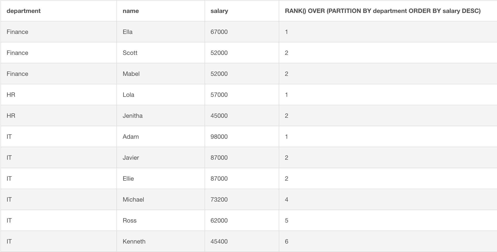
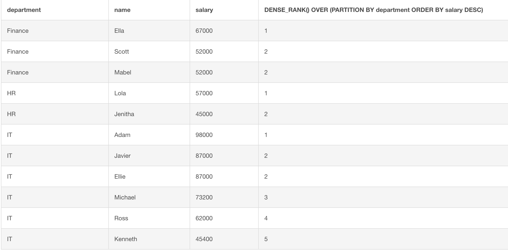

# SQL Rank Functions

## Introduction
We will look into how to apply `RANK()`, `ROW_NUMBER()`, and `DENSE_RANK()` functions on SQL window functions.

## Objectives
- Learn how to use `RANK()`, `ROW_NUMBER()`, and `DENSE_RANK()` functions appropriately

### What are rank functions?

SQL rank functions, as the name entails, ranks rows. `ROW_NUMBER()` does just what it sounds like - it displays the number of a given row. 
`RANK()` and `DENSE_RANK()` both rank rows based on the `ORDER BY` clause. The difference between two is that `DENSE_RANK()` would consider tying records and not skip rows. Let's say two rows are tied, then both rows would get the same rank, and the next row would be next incremental number, without skipping a rank. 

### Examples

Let's pull up the [db-fiddle](https://www.db-fiddle.com/) page and set up the database as `SQLite`.

Insert these queries in the left panel.

```
CREATE TABLE EMPLOYEE (
  id INTEGER PRIMARY KEY,
  name TEXT,
  department TEXT,
  salary INTEGER
);

INSERT INTO EMPLOYEE VALUES (1, "Javier", "IT", 87000);
INSERT INTO EMPLOYEE VALUES (2, "Michael", "IT", 73200);
INSERT INTO EMPLOYEE VALUES (3, "Jenitha", "HR", 45000);
INSERT INTO EMPLOYEE VALUES (4, "Ross", "IT", 62000);
INSERT INTO EMPLOYEE VALUES (5, "Scott", "Finance", 52000);
INSERT INTO EMPLOYEE VALUES (6, "Ella", "Finance", 67000);
INSERT INTO EMPLOYEE VALUES (7, "Adam", "IT", 98000);
INSERT INTO EMPLOYEE VALUES (8, "Kenneth", "IT", 45400);
INSERT INTO EMPLOYEE VALUES (9, "Mabel", "Finance", 52000);
INSERT INTO EMPLOYEE VALUES (10, "Ellie", "IT", 87000);
INSERT INTO EMPLOYEE VALUES (11, "Lola", "HR", 57000);
```

We want to see who's getting paid the most by each department. From this problem, you can guess that we're partitioning the data over `department`. We want the names as well, so let's run this query below:
```
SELECT department, name, salary, RANK() OVER (PARTITION BY department ORDER BY salary DESC) FROM EMPLOYEE;
```


You can see employees in the order of salary, divided by department. Look at Finance and IT - Scott and Mabel from Finance are paid the same salary, so you can see that they have the same rank. In IT, Javier and Ellie are getting paid the same, so they have rank of 2, and Michael has 4, skpping rank 3.

Switch out `RANK()` with `DENSE_RANK()` from above query to see the difference. `DENSE_RANK()` would tie Javier and Ellie from IT, and Michael has rank of 3. 



You'll need to choose between two functions based on how you want your application to behave.


### Summary

In this lesson, we went over the difference between `RANK()` and `DENSE_RANK()`. Depending on the usage of an application, we'll need to carefully choose which function to use. 


```python

```
